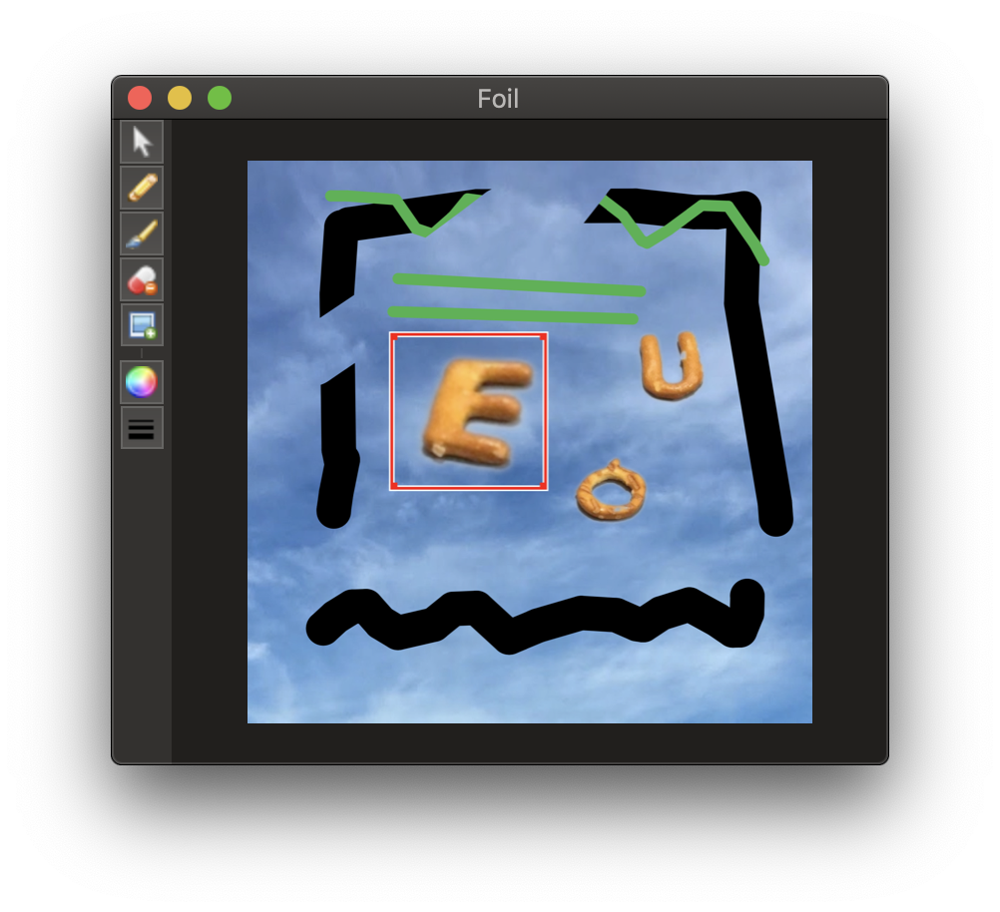

# Foil

A simple image editor component for cocoa.

## How to install 

Using [Carthage](https://github.com/Carthage/Carthage), add the following to your `Cartfile`:

`github "marcoconti83/Foil"`

## How to use

Use `ImageEditorViewController`, a `NSViewController`, to display the canvas and a toolbar. If you want more control, you can instead use `ImageEditView`, a `NSView`, but you have to handle tool selection and zoom/panning on your own.

